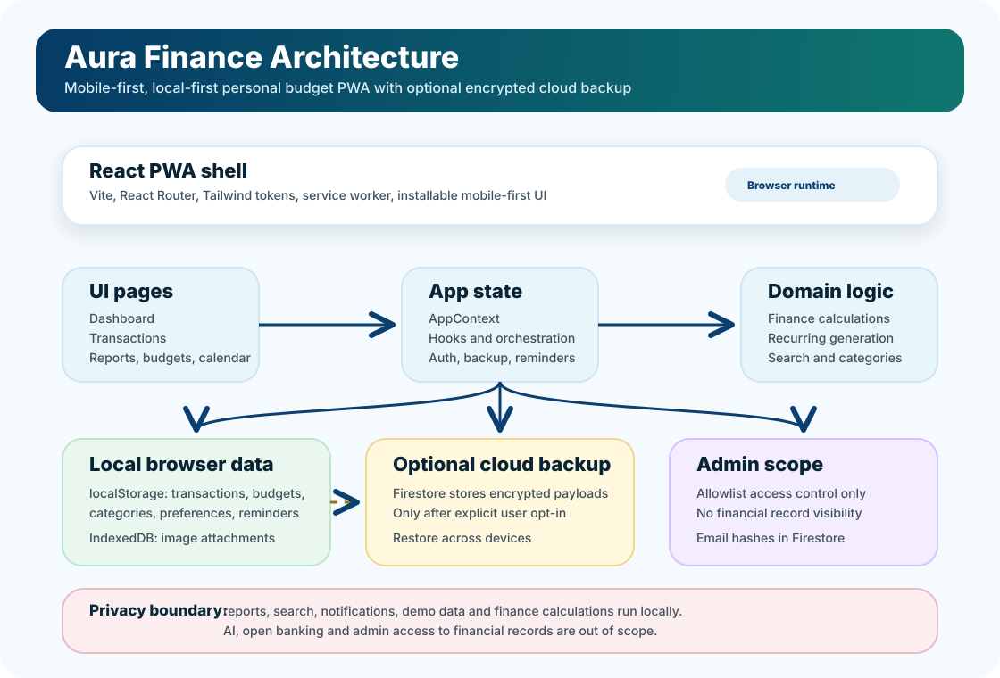

# Aura Finance

[](https://react.dev/)
[](https://www.typescriptlang.org/)
[](https://vite.dev/)
[](https://tailwindcss.com/)
[](https://firebase.google.com/)
[](https://web.dev/explore/progressive-web-apps)
[](#privacy-and-security)

Aura Finance is a mobile-first Progressive Web App for managing personal budgets, expenses, income, recurring payments, savings goals, and financial reports without giving up control of personal data.

The project is built around one clear principle: financial data stays in the user's browser first. Cloud storage exists only as an optional encrypted backup, enabled explicitly by the user. Admin access is limited to allowlist management and does not expose personal financial records.

## Mission

Help people quickly understand how much they can spend, where their money is going, and which recurring commitments are coming up, while keeping a concrete privacy-first posture.

Aura Finance prioritizes:

- local data and explicit user control;
- reliable financial numbers for everyday decisions;
- a fast, readable mobile-first interface for frequent use;
- useful reports without sending data to external services;
- simple, testable, and maintainable architecture.

## Problem It Solves

Many budgeting apps are too complex, require cloud accounts, integrate bank data, or treat privacy as a generic promise. Aura Finance focuses on a more restrained use case: a person wants to record income and expenses, track budgets and recurring payments, read clear reports, and optionally keep an encrypted backup without handing their full financial history to an application backend.

## Core Features

- Dashboard with total balance, income, expenses, safe-to-spend, and spending summary.
- Transaction management with categories, date, payment method, notes, and local attachments.
- History with search, filters, editing, deletion, and financial trajectory.
- Category budgets with progress state and in-app alerts.
- Recurring payments with daily, weekly, monthly, and yearly frequencies.
- Calendar view for transactions and recurring items.
- Reports, period comparison, and year-in-review calculated locally.
- Global search across transactions, recurring items, budgets, goals, and categories.
- Savings goals and category management with archiving to preserve historical meaning.
- CSV import/export for data portability.
- Local notifications and reminders through the browser and service worker.
- Light/dark theme, installable PWA, and mobile-first design.
- Google sign-in with Firebase Authentication.
- Optional encrypted Firestore backup for cross-device restore.
- Admin panel limited to user allowlist management.
- First-run flow with a choice between restoring a found backup, using local demo data, or starting from scratch.

## Functional Preview

The following screens show the app's main flow with local demo data: quick financial status, transaction entry, history analysis, reports, budgets, and recurring items.

| Dashboard | Spending Breakdown | New Transaction |
|---|---|---|
|  |  |  |
| Total balance, safe-to-spend, and monthly metrics to understand available money at a glance. | Donut chart and category breakdown to identify the main spending areas. | Mobile-first entry for movement type, amount, title, category, date, and payment method. |

| History | Monthly Report | Report Detail |
|---|---|---|
|  |  |  |
| Date-sorted transaction list with amounts, categories, and descriptions. | Local report with income, expenses, net flow, and comparison with the previous period. | Category analysis with budget progress and changes from the previous period. |

| Calendar | Recurring Items | Budgets |
|---|---|---|
|  |  |  |
| Monthly view with daily indicators for transactions and recurring items. | Active recurring items, generated transactions, and details for the selected day. | Monthly category limits, spent amount, remaining amount, and overall progress. |

## Privacy And Security

Aura Finance follows a local-first model:

- transactions, budgets, categories, preferences, and reminders are stored locally in the browser;
- image attachments are stored in IndexedDB;
- cloud backup is disabled by default;
- when backup is enabled, the payload is encrypted before being written to Firestore;
- admins cannot access users' financial records;
- no AI features are included in the current scope;
- notifications, search, comparisons, and reports are calculated locally;
- demo data is generated and stored only in the browser; if a cloud backup exists and the user chooses blank or demo data, local cloud backup is disabled to prevent accidental overwrite.

For operational details, see [privacy-notes.md](docs/04-privacy-gdpr/privacy-notes.md), [project-brief.md](product/project-brief.md), and [solution-strategy.md](docs/00-discovery/01-solution-strategy.md).

## Tech Stack

| Area | Technology |
|---|---|
| Frontend | React 19, TypeScript, Vite |
| Styling | Tailwind CSS 4, CSS design tokens |
| Motion | Motion / Framer Motion API |
| Charts | Recharts |
| Local storage | localStorage, IndexedDB through `idb-keyval` |
| Auth and optional cloud | Firebase Authentication, Firestore |
| Tests | Vitest, TypeScript typecheck |
| Deploy | Firebase Hosting |

## Repository Architecture



```text
src/
  components/        Reusable UI components
  context/           Application state and client orchestration
  data/              Storage keys and local data helpers
  domain/            Pure finance, recurring, category, and search logic
  hooks/             Application hooks and browser integrations
  lib/               Firebase, encrypted backup, and shared utilities
  pages/             Main application routes
  utils/             Formatters and cross-cutting helpers

docs/                Discovery, strategy, privacy, and product analysis
product/             Product brief and intent
public/              Manifest, service worker, and static assets
scripts/             Operational scripts, including hosting deploy
```

Product and architecture decisions are documented in `product/` and `docs/00-discovery/`. Before changing flows, data, privacy, security, or architecture, also read [AGENTS.md](AGENTS.md).

## Run Locally

Prerequisite: Node.js installed.

1. Install dependencies:

   ```bash
   npm install
   ```

2. Copy the environment file:

   ```bash
   cp .env.example .env
   ```

3. Fill `.env` with the required Firebase values.

4. Start the app:

   ```bash
   npm run dev
   ```

The app is served by Vite on port `3000`.

## Firebase Setup

In the Firebase project:

1. enable Google sign-in in Authentication;
2. create a Firestore database;
3. configure rules from [firestore.rules](firestore.rules);
4. fill the `VITE_FIREBASE_*` variables in `.env`.

Main collections:

- `allowedUsers/{emailHash}`: access allowlist based on hashed email;
- `backups/{uid}`: optional cloud backup, encrypted client-side.

## Available Scripts

| Command | Purpose |
|---|---|
| `npm run dev` | Start Vite in development |
| `npm run lint` | Run the TypeScript typecheck |
| `npm run test` | Run Vitest tests |
| `npm run test:watch` | Start Vitest in watch mode |
| `npm run build` | Generate the production build |
| `npm run preview` | Serve the build locally |
| `npm run firebase:login` | Sign in with the Firebase CLI |
| `npm run deploy:hosting` | Build and deploy to Firebase Hosting |

## Deploy To Firebase Hosting

1. Sign in to Firebase:

   ```bash
   npm run firebase:login
   ```

2. Make sure `VITE_FIREBASE_PROJECT_ID` is configured in `.env`, or pass `FIREBASE_PROJECT_ID`.

3. Deploy:

   ```bash
   npm run deploy:hosting
   ```

To deploy to a specific project without editing `.env`:

```bash
FIREBASE_PROJECT_ID=your-project-id npm run deploy:hosting
```

## Useful Documentation

- [Project brief](product/project-brief.md)
- [Project analysis](docs/00-discovery/00-project-analysis.md)
- [Solution strategy](docs/00-discovery/01-solution-strategy.md)
- [Delivery plan](docs/00-discovery/02-delivery-plan.md)
- [Privacy/GDPR notes](docs/04-privacy-gdpr/privacy-notes.md)

## Project Status

Aura Finance is an evolving PWA. The current scope includes personal budgeting, local reporting, optional encrypted backup, and access control. AI, automated financial advice, open banking, and admin visibility into users' financial data are explicitly out of scope for now.
