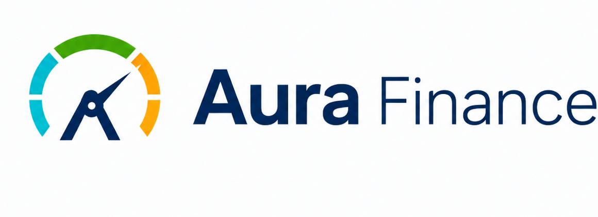
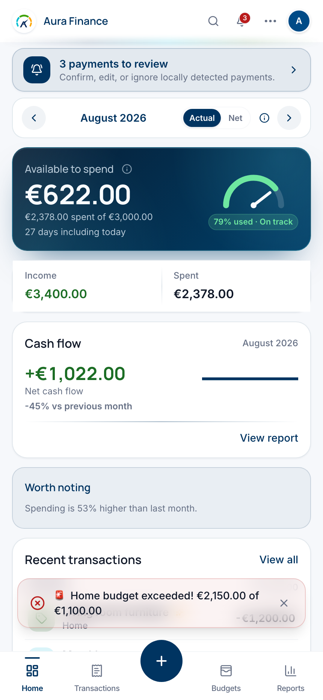
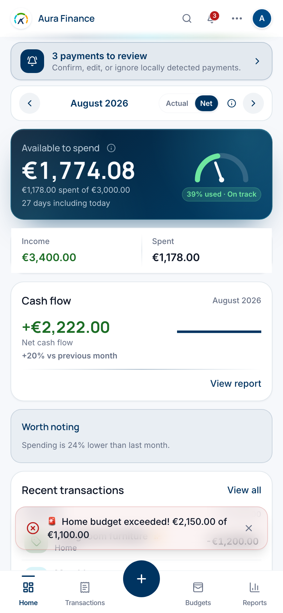
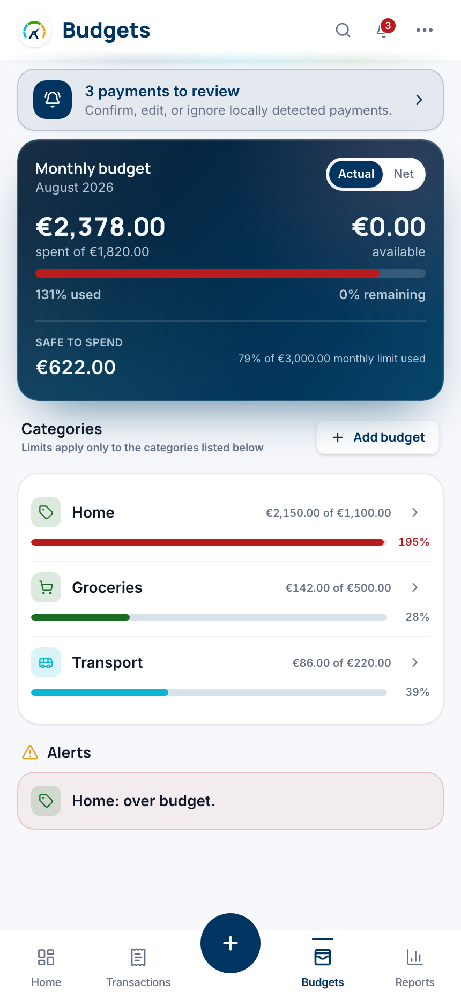
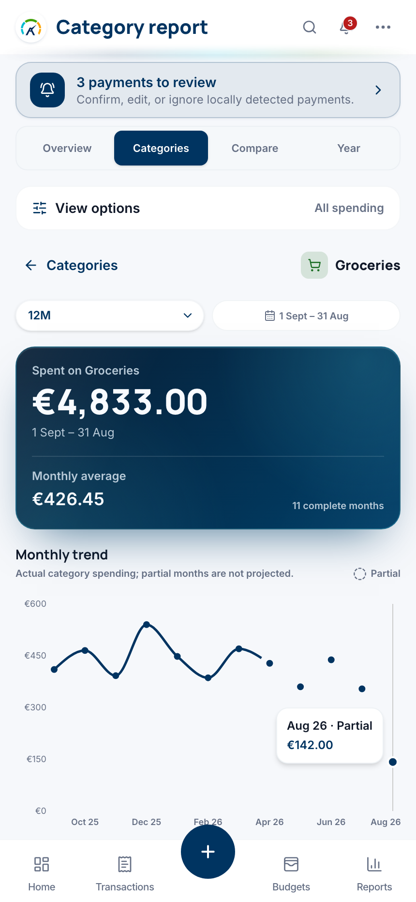
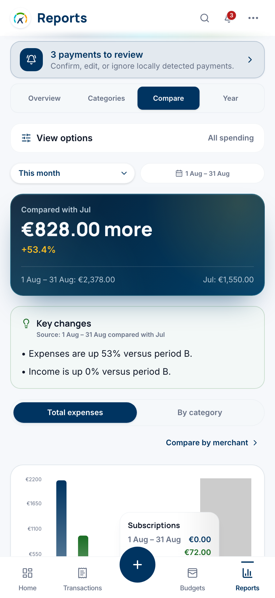
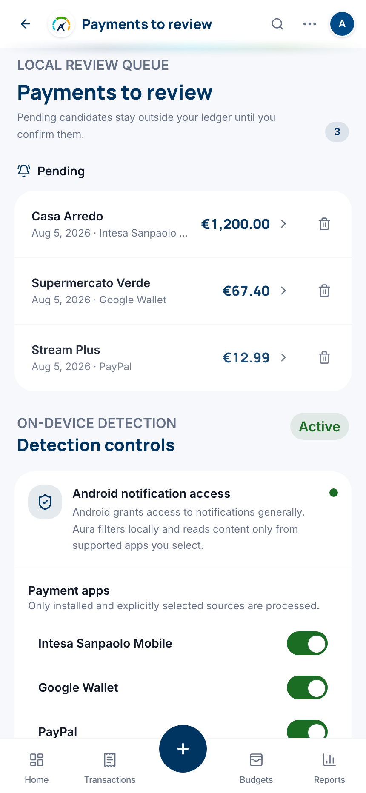
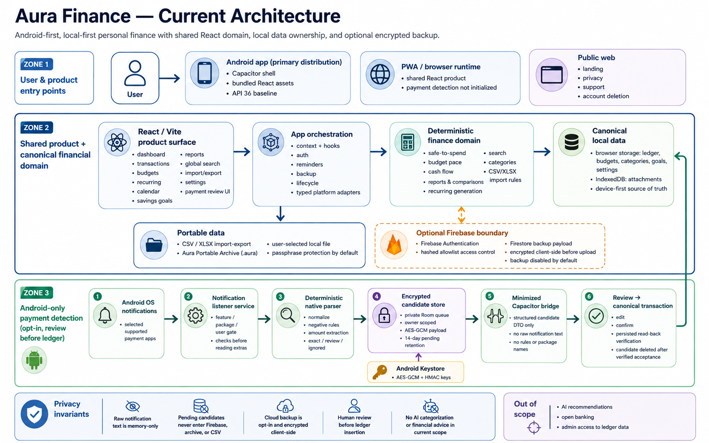

<p align="center">
  <picture>
    <source media="(prefers-color-scheme: dark)" srcset="./public/aura-logo-dark.png">
    <source media="(prefers-color-scheme: light)" srcset="./public/aura-logo-light.png">
    
  </picture>
</p>

<h1 align="center">Aura Finance</h1>

<p align="center">
  <strong>Private, Android-first personal finance</strong><br>
  Understand what you can spend, where your money goes, and what needs attention—without making a cloud backend the owner of your financial history.
</p>

<p align="center">
  <a href="#why-this-exists">Why</a> ·
  <a href="#values-and-opportunities">Value</a> ·
  <a href="#what-aura-does">Capabilities</a> ·
  <a href="#mobile-product-walkthrough">Screens</a> ·
  <a href="#privacy-and-data-lifecycle">Privacy</a> ·
  <a href="#how-it-works">Architecture</a> ·
  <a href="#run-it">Run it</a> ·
  <a href="#evidence-and-maturity">Status</a>
</p>

<p align="center">
  
  
  
  
  
</p>

## Why this exists

Personal finance software should help a person make everyday decisions without requiring their complete financial history to live in an application backend.

Aura Finance is built around a narrower, deliberate promise: record and understand income, expenses, budgets, recurring commitments, and savings goals locally; make backup optional and encrypted; keep every imported or detected transaction under explicit user control.

The product answers three practical questions:

- **What can I safely spend?** Aura combines the current budget, recorded spending, and remaining days into a direct monthly signal.
- **Where is my money going?** Local reports expose category totals, trends, period comparisons, and exceptional spending.
- **What needs review?** Budget alerts, recurring items, imports, and Android payment candidates remain visible until the user decides what belongs in the ledger.

Aura does not provide financial advice, connect to bank accounts, or use AI to categorize transactions. Its financial calculations and current import workflow are deterministic and local.

## Values and opportunities

| Value | What it means in Aura | Opportunity it creates |
| --- | --- | --- |
| **Local-first ownership** | Transactions, budgets, reports, preferences, and attachments live on the device first | Useful financial software with a smaller default data-exposure surface |
| **Human-reviewed automation** | Imports and detected payments are proposals until the user confirms them | Faster capture without silent or irreversible ledger changes |
| **Explainable numbers** | Safe-to-spend, pace, totals, and comparisons come from deterministic domain rules | Everyday decisions that can be traced back to recorded data |
| **Optional encrypted continuity** | Cloud backup is disabled by default and encrypted client-side when enabled | Restore and cross-device continuity without plaintext financial records in Firestore |
| **Portable data** | CSV interoperability and the Aura Portable Archive keep exit and recovery paths explicit | User-controlled migration, disaster recovery, and long-term access |
| **Shared, replaceable boundaries** | The React financial domain is isolated from Android-only capabilities through typed adapters | Native features can evolve without rewriting the canonical ledger or reports |

## What Aura does

Aura provides a complete personal-budget workflow:

1. **Record income and expenses** with categories, dates, payment methods, notes, attachments, and explicit extra/refund treatment.
2. **Track monthly budgets** with remaining amounts, pace, safe-to-spend, and local alerts.
3. **Understand cash flow** through monthly, category, comparison, and year-in-review reports.
4. **Manage recurring commitments** and inspect them alongside transactions in a calendar.
5. **Plan savings goals** while preserving historical category meaning through archive/restore.
6. **Import and export deterministically** through transaction CSV/XLSX workflows and the complete `.aura` portable archive.
7. **Review Android payment candidates** before they become canonical Aura transactions.
8. **Opt into encrypted backup** through Firebase Authentication and client-side encrypted Firestore storage.

### Current product surfaces

- dashboard with safe-to-spend, cash flow, alerts, and recent transactions;
- transaction history with search, filters, editing, and deletion;
- budgets, recurring payments, calendar, savings goals, and categories;
- reports with Actual/Net lenses, category details, comparisons, and spending pace;
- global search across the local workspace;
- Android-only payment detection and review behind platform adapters;
- settings for data portability, encrypted backup, notifications, appearance, and account lifecycle.

## Mobile product walkthrough

These captures turn the feature list into three concrete decisions. They use synthetic demo data rendered by the current Aura mobile UI; no real account, payment, or financial data is shown.

### 1. Did one large purchase really change the monthly pattern?

<table>
  <tr>
    <th>See everything that happened</th>
    <th>Separate exceptional spending</th>
  </tr>
  <tr>
    <td align="center"><a href="public/landing/aura-home.png"></a></td>
    <td align="center"><a href="public/landing/aura-home-net.png"></a></td>
  </tr>
  <tr>
    <td align="center"><strong>Actual</strong> keeps the complete cash record visible, including the €1,200 furniture purchase.</td>
    <td align="center"><strong>Net</strong> separates that marked Extra so the repeatable monthly pattern remains readable.</td>
  </tr>
</table>

**Value:** one ledger answers two different questions without deleting or rewriting a transaction: “What happened?” and “What does a normal month look like?”

### 2. Where should I act before the month gets away from me?

<table>
  <tr>
    <th>Find the category that needs attention</th>
    <th>Check whether it is a pattern</th>
  </tr>
  <tr>
    <td align="center"><a href="public/landing/aura-budgets.png"></a></td>
    <td align="center"><a href="public/landing/aura-reports-category-groceries.png"></a></td>
  </tr>
  <tr>
    <td align="center">Budget status and alerts make the immediate exception visible instead of hiding it in a total.</td>
    <td align="center">Complete-month averages and category trends distinguish a recurring baseline from a temporary spike.</td>
  </tr>
</table>

**Value:** Aura connects an actionable monthly alert to the local history needed to set a realistic target.

### 3. What changed, and what still needs my decision?

<table>
  <tr>
    <th>Explain the difference</th>
    <th>Review before recording</th>
  </tr>
  <tr>
    <td align="center"><a href="public/landing/aura-reports-compare.png"></a></td>
    <td align="center"><a href="public/landing/aura-payment-detection.png"></a></td>
  </tr>
  <tr>
    <td align="center">Period comparison turns “spending went up” into an amount, percentage, and category-level explanation.</td>
    <td align="center">Locally detected candidates stay outside the canonical ledger until they are edited, confirmed, or ignored.</td>
  </tr>
</table>

**Value:** explainable analysis and human-reviewed automation reduce manual work without taking control away from the user.

> [!NOTE]
> The payment-review capture uses repository-controlled synthetic source fixtures. It is product/UI evidence, not proof of compatibility with a real banking or payment application. Real payment-app support remains release-gated.

## Privacy and data lifecycle

Local-first is an architectural boundary, not a generic privacy claim. Aura makes each persistence and transfer path explicit.

| Data | Default location | Lifecycle and control |
| --- | --- | --- |
| Transactions, budgets, categories, goals, settings | Browser storage inside the bundled application | Persists locally until edited, reset, archived, or deleted by the user |
| Attachments | IndexedDB | Local-only unless included in an explicitly exported portable archive |
| Pending Android payment candidates | Private encrypted native Room store | Short-lived, owner-scoped, excluded from backup, and removable without creating a transaction |
| Aura Portable Archive | User-selected local file | Exported only on request; passphrase protection is selected by default |
| Optional cloud backup | Firestore | Disabled by default; encrypted client-side before upload and controlled from settings |
| Authentication identity | Firebase Authentication | Used for allowlist access and optional backup ownership, not admin access to ledger contents |

Default privacy properties:

- financial reports, search, comparisons, and import classification run locally;
- no AI features or automated financial advice are in the current scope;
- administrators manage the access allowlist but cannot read users’ financial records;
- Android payment detection is opt-in, filters selected supported sources locally, and requires review before ledger insertion;
- pending candidates are excluded from cloud backup, portable archives, and Android system backup;
- logout, account change, reset, and account deletion trigger dedicated local-data lifecycle handling.

For the operational baseline, read [privacy notes](docs/04-privacy-gdpr/privacy-notes.md), the [payment-detection processing record](docs/04-privacy-gdpr/android-payment-detection-processing-record.md), and the [portable-archive processing record](docs/04-privacy-gdpr/portable-archive-processing-record.md).

## How it works



Aura uses one canonical financial domain with platform-specific boundaries around it:

- **React product surface** — pages, shared components, and local orchestration for the bundled application.
- **Domain layer** — deterministic finance, recurring-payment, reporting, category, search, and import rules.
- **Local data layer** — browser storage and IndexedDB for the canonical workspace and attachments.
- **Platform adapters** — typed boundaries isolate Android-only payment detection from web-based tests and the financial domain.
- **Native Android layer** — Capacitor plugins, Keystore-backed ownership, encrypted candidate storage, notification controls, and review deep links.
- **Optional Firebase boundary** — authentication, hashed allowlist records, and client-side encrypted backup payloads.
- **Public web boundary** — landing, privacy, support, and account-deletion surfaces only; the personal-finance app is distributed through Android.

### Repository map

| Area | Responsibility |
| --- | --- |
| `src/domain/` | Pure finance, recurring, reporting, search, and import rules |
| `src/data/` | Local persistence keys and data helpers |
| `src/context/`, `src/hooks/` | Application state and client-side orchestration |
| `src/pages/`, `src/components/` | Product routes and reusable UI |
| `src/platform/` | Typed native/web capability boundaries |
| `android/` | Capacitor Android shell and native Kotlin plugins |
| `docs/` | Strategy, architecture, privacy, operations, QA, and release evidence |
| `product/` | Current product intent and scope |

## Run it

The shared React runtime is available locally for development and browser regression testing. The product distribution target is the bundled Android application.

### Prerequisites

- Node.js 20+
- npm
- JDK 21 for Android work
- Android SDK platform and build tools 36 for the current Android baseline
- repository-specific Firebase configuration for authenticated or Android debug flows

### Launch the local React runtime

```bash
git clone https://github.com/daniele21/personal-budget.git
cd personal-budget
npm install
cp .env.example .env
npm run dev
```

Vite serves the development runtime at `http://localhost:3000`.

### Build the Android debug application

Create the ignored `.env.android-debug.local` using the `VITE_ANDROID_FIREBASE_*` values documented in `.env.example`, then run:

```bash
npm run android:sync:debug
npm run android:assemble:debug
```

The isolated debug application uses `com.staituned.aura.debug` and the `Aura Dev` label. Signing files, `google-services.json`, SDK paths, OAuth credentials, and keystores must remain outside source control.

For emulator setup, diagnostics, deep links, authentication troubleshooting, notification simulation, and cleanup, use the [Android payment-detection runbook](docs/03-operations/android-payment-detection-runbook.md).

## Build and validate

Use the narrowest checks for the area being changed. The repeatable repository gates are:

```bash
npm run lint
npm run test
npm run build
npm run android:test
npm run android:lint
```

Connected Android verification additionally includes:

```bash
npm run android:test:instrumentation
npm run android:verify:webview
```

Useful focused commands:

| Command | Purpose |
| --- | --- |
| `npm run test:e2e` | Browser end-to-end regression suite |
| `npm run android:sync:diagnostic` | Build with explicitly enabled local WebView diagnostics |
| `npm run android:simulate:wallet-notification` | Exercise the synthetic payment-notification flow on an emulator |
| `npm run android:verify:listener-recovery` | Verify listener process recreation, reboot, revocation, and cleanup |
| `npm run verify:gemini-retirement` | Guard the deterministic, non-AI transaction import boundary |
| `npm run deploy:hosting` | Publish only the public landing/legal/support surfaces |

## Evidence and maturity

Aura is an active Android product under controlled release preparation, not a generally available financial service.

Current implemented evidence includes:

- canonical local ledger, budgeting, recurring, reporting, search, and savings workflows;
- deterministic CSV/XLSX transaction import with review and duplicate warnings;
- local Aura Portable Archive with replace-only recovery and post-persistence verification;
- optional client-side encrypted Firestore backup;
- Android Credential Manager authentication bridge;
- private payment-candidate storage, minimized bridge, review queue, and synthetic end-to-end notification fixtures;
- browser, unit, Android unit, lint, packaging, WebView, and instrumentation verification paths.

Current release boundaries:

- distribution begins with Play Internal Testing and a named closed beta;
- the initial production candidate is core-only, with payment detection beta-gated;
- Android 16/API 36 is the current internal/beta baseline;
- real payment-app support remains blocked on privacy-approved fixtures and package/template evidence;
- physical-device, accessibility, memory, signing, Play Console, privacy-owner, rollout, and rollback gates remain authoritative;
- AI recommendations, automated financial advice, open banking, and admin access to ledger data remain out of scope.

Use these sources for the current truth:

- [Project brief](product/project-brief.md)
- [Solution strategy](docs/00-discovery/01-solution-strategy.md)
- [Production-readiness plan](docs/00-discovery/14-consolidated-production-readiness-plan.md)
- [Release decision pack](docs/00-discovery/15-c2-release-decision-pack.md)
- [Android payment-detection specification](docs/specs/android-payment-detection-mvp.md)
- [Android payment-detection security architecture](docs/01-architecture/android-payment-detection-security.md)
- [Testing strategy](docs/testing-strategy.md)

## Firebase boundary

Firebase is optional for personal financial data continuity, but required for the current authenticated allowlist flow.

Main collections:

- `allowedUsers/{emailHash}` — access allowlist based on a normalized email hash;
- `backups/{uid}` — optional backup payload encrypted on the client before upload.

The two designated administrator accounts are defined in `src/config/adminAccess.ts` and mirrored by `isAdmin()` in `firestore.rules`. Regression tests fail if the policies diverge. Administrators do not receive access to users’ plaintext financial data.

## Responsible use

Aura is a budgeting and record-keeping tool, not a bank, accounting system, or source of financial advice. Users remain responsible for reviewing imported, detected, and manually entered transactions and for maintaining appropriate backups of data they need to retain.
