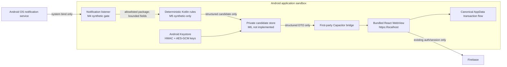

# Android Payment Detection Security Boundary

## Status And Scope

This document records the M3 engineering controls implemented before Aura is
allowed to read payment notifications. It is not legal advice or a privacy
approval.

As of 2026-07-28:

- an M4 `NotificationListenerService` exists and is exercised only by a
  separate controlled synthetic test APK;
- an M5 deterministic rule engine parses only the bundled synthetic corpus;
- no candidate database or Aura payment notification exists;
- no real notification content is read; tests read only one static synthetic
  title/text fixture from the controlled source APK;
- the native bridge accepts only an authenticated Firebase UID for owner
  registration and a bounded purge reason;
- real-notification work remains blocked by privacy-owner approval, the DPIA
  screening, and the M4 source-selection gate.

## Data Flow And Trust Boundaries



Trust boundaries:

- Android grants notification access to the listener as a whole. The M4
  listener checks the source package and user selection before reading extras.
- Native storage is private to the application and is not an extension of
  React `AppData`.
- The WebView is untrusted input to native plugins. Bridge arguments are
  validated and notification text, fingerprints, keys, and tokens are never
  bridge inputs or outputs.
- Firebase remains the source of the authenticated UID. Detection candidates
  never enter Firebase, Gemini, analytics, crash reporting, Aura archives, or
  CSV.

## Data Lifecycle

| Phase | Data | Persistence | Deletion |
|---|---|---|---|
| M3 owner registration | Firebase UID, transient bridge input | UID is HMAC-SHA256 transformed; only the owner hash is stored | Logout, owner change, local reset, total deletion |
| M5 synthetic parsing | Internal source ID, bounded title/text/bigText and post time | Raw strings remain in memory only; only redacted process counters survive the call | References discarded after parsing; debug recovery probe removed during cleanup |
| Future candidate | Amount, EUR currency, optional merchant, timestamps and workflow metadata | Entire structured payload encrypted with AES-GCM in the private database | Retention, ignore, acceptance, reset, logout, owner change or deletion |
| Confirmed transaction | User-reviewed normal transaction fields | Canonical React `AppData` | Existing Aura controls |

Excluded by design: OTPs, balances, card/account identifiers, raw notification
strings, Firebase/Google tokens, email, icons, images, actions and remote views.

## Owner Isolation And Purge

The Firebase UID is never stored directly in native payment-detection storage.
`OwnerKeyHasher` derives a URL-safe HMAC-SHA256 value with a non-exportable
Android Keystore key. Email and authentication tokens are not accepted.

`PaymentDetectionPrivacyStore` records a purge journal before deleting the
future candidate database and native preferences. An interrupted purge is
retried on plugin load and on the next owner registration. Registering a
different owner purges the previous namespace before installing the new owner
boundary.

Purge reasons are limited to:

- logout;
- account change;
- local reset;
- total deletion.

Total deletion also removes the HMAC and AES-GCM Keystore entries. Logout,
account change, and local reset remove local detection data but retain the
device keys. Native purge failure makes authentication fail closed rather than
opening the application under an unverified owner boundary.

## Encryption And Identifiers

- Candidate IDs are generated from 144 bits of `SecureRandom` entropy and
  encoded as unpadded Base64 URL values.
- The future structured candidate payload uses AES-256-GCM with a
  non-exportable Android Keystore key.
- Schema version, candidate ID, and owner hash are authenticated as associated
  data. A mismatch produces an authentication failure.
- If the Keystore key is missing, invalidated, or unusable, encrypted candidate
  data is considered unrecoverable. The safe recovery is to purge native
  detection storage, recreate the owner boundary, and ask the user to review
  new candidates only. The application must not fall back to plaintext.

## WebView And Android Surface

- Production assets are bundled; `capacitor.config.ts` has no remote
  `server.url`.
- `AuraBridgeWebViewClient` permits privileged WebView navigation only to the
  exact Capacitor origin `https://localhost` and rejects user info, ports, and
  other origins.
- Cleartext traffic is disabled in both the manifest and network-security
  configuration.
- The web bundle and Firebase Hosting use a restrictive CSP with no
  `unsafe-eval` and no object embedding.
- Auto Backup is disabled. Legacy backup rules and Android data-extraction
  rules exclude all file, database, preference, external, and device-protected
  domains from cloud backup and device transfer.
- Aura-owned helpers and receivers are non-exported. The launcher/deep-link
  activity is the only Aura-owned exported component in M3.
- Release builds enable R8/resource shrinking and remove `android.util.Log`
  calls. No crash-reporting or breadcrumb SDK is installed.

The repeatable safe verification is:

```bash
npm run test -- src/platform/__tests__/androidSecurityConfiguration.test.ts
npm run android:test
npm run android:test:instrumentation
ANDROID_SERIAL=<dedicated-api-36-emulator> npm run android:verify:listener-recovery
```

The first command checks source backup/extraction, CSP, runtime, bridge, and
release-hardening configuration. Instrumentation checks the effective installed
manifest, cleartext policy, component exposure, owner isolation, purge, opaque
IDs, authenticated encryption, and the synthetic exact parser path. The
recovery command is emulator-only and validates process recreation, listener
rebind, reboot and revocation using redacted counts. A transport-backed
`bmgr backupnow` is not part of routine developer verification because it can
export application data; OEM device-to-device behavior remains a physical
release gate.

## Threat Model

| Threat | Implemented M3 control | Remaining verification |
|---|---|---|
| Wrong user sees prior local candidates | HMAC owner partition, account-change purge, fail-closed registration | M6 database queries and migrations |
| Interrupted or partial deletion | Persisted purge journal and startup recovery | M6 Room deletion and failure injection |
| Ciphertext or owner context is modified | AES-GCM with owner/ID/schema AAD | M6 repository integration |
| Keystore key is invalidated | No plaintext fallback; purge-and-recreate policy | Physical lock/reset scenarios |
| XSS invokes native APIs | Bundled allowlisted origin, CSP, narrow bridge | Ongoing dependency and UI review |
| Spoofed deep link leaks financial data | Allowlisted routes and opaque IDs; no financial URL values | M7 invalid-ID and intent tests |
| Backup or device transfer exports data | `allowBackup=false` plus exhaustive exclusion rules | OEM physical transfer test |
| Logs or crashes capture candidate fields | Release log stripping; no crash SDK; raw fields absent from bridge; M5 has no content logging | M6-M7 logcat tests |
| Exported component accepts app actions | Listener and FileProvider non-exported; listener protected by the system bind permission | Recheck every manifest change |
| Unsupported notification is inspected | Package/selection gate executes before the deferred extras extractor | Real-source review remains prohibited |
| Regex denial of service blocks listener | Bounded NFKC input, precompiled static patterns, unsafe-pattern rejection and parsing benchmark | Repeat for every approved real-source rule |
| Card/account identifier becomes merchant | Identifier-like merchant values are dropped and negative fixture coverage excludes security/account contexts | Revalidate against every approved real-source corpus |

## Controls Required In Later Milestones

M4 declares only the non-exported system-bound listener with
`android.permission.BIND_NOTIFICATION_LISTENER_SERVICE`, no custom application
actions, and package/selection checks before extras. Its catalog currently
contains only the separate signature-protected synthetic test APK. M5 applies
negative rules before exact/review rules, supports EUR only, releases raw
strings after evaluation, and sends no result to storage or the bridge. M7 must
use immutable, unique `PendingIntent` objects and a `VISIBILITY_PRIVATE` Aura
notification with a fully redacted public version.

The prominent disclosure must explain that Android grants broad notification
access while Aura internally processes only explicitly supported and selected
payment apps. Enabling requires a separate affirmative action; navigation,
dismissal, or an existing OS grant is not consent. The same surface must expose
pause, app deselection, Android-settings revocation, candidate deletion, local
reset, logout purge, and total deletion.

## Residual Governance Gates

- privacy owner and controller/processor role assignment;
- lawful-basis record and data inventory/RoPA update;
- DPIA screening decision;
- approved real-app fixture and redaction process;
- security-owner acceptance of the threat model;
- physical backup/device-transfer and logcat verification;
- Google Play Data Safety and disclosure review.

Until those gates are recorded, M3 is an engineering foundation and not
authorization to process real financial notifications.
