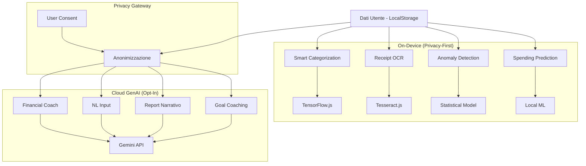

# 🔍 Analisi Completa — Aura Finance

> **Progetto:** Aura Finance — Personal Budget PWA  
> **Stack:** React 19 · Vite 6 · TypeScript 5.8 · Tailwind CSS 4 · Framer Motion · Recharts · Firebase Auth · Firestore  
> **Codebase:** ~8.300 righe TS/TSX · 10 pagine · 17 componenti · 5 hook · 3 moduli domain  
> **Data analisi:** 25 aprile 2026

---

## 1. Documentazione — Voto: ⭐⭐⭐⭐ (4/5)

### ✅ Punti di Forza

| Documento | Stato | Qualità |
|---|---|---|
| [README.md](file:///Users/moltisantid/Personal/personal-budget/README.md) | ✅ Presente | Conciso, con setup locale, Firebase e deploy. Sufficiente per un dev |
| [project-brief.md](file:///Users/moltisantid/Personal/personal-budget/product/project-brief.md) | ✅ Presente | Chiara definizione di goal, utente target, scope e non-scope |
| [functional_requirements.md](file:///Users/moltisantid/Personal/personal-budget/functional_requirements.md) | ✅ Presente | Descrizione completa delle features richieste (in italiano) |
| [00-project-analysis.md](file:///Users/moltisantid/Personal/personal-budget/docs/00-discovery/00-project-analysis.md) | ✅ Eccellente | Analisi UX/UI dettagliatissima con priorità, problemi e raccomandazioni |
| [01-solution-strategy.md](file:///Users/moltisantid/Personal/personal-budget/docs/00-discovery/01-solution-strategy.md) | ✅ Presente | Decisioni architetturali chiave documentate con rationale |
| [02-delivery-plan.md](file:///Users/moltisantid/Personal/personal-budget/docs/00-discovery/02-delivery-plan.md) | ✅ Presente | Piano di delivery con quality gates e privacy checks |
| [AGENTS.md](file:///Users/moltisantid/Personal/personal-budget/AGENTS.md) | ✅ Completo | Framework robusto per governance del progetto |

- **Docstring nel codice**: i moduli domain (`finance.ts`, `recurring.ts`, `categories.ts`), gli hook (`useCloudBackup.ts`, `useFirebaseAuth.ts`, `useBudgetAlerts.ts`), e `backup.ts` hanno tutti JSDoc ben fatti con spiegazione del design e del comportamento
- **Storage Keys centralizzati**: tutti i magic strings sono registrati in `storageKeys.ts` con commento
- **Decisioni esplicite**: "no AI", "admin = allowlist only", "local-first" sono documentate con rationale chiaro

### ⚠️ Gap

| Area | Problema |
|---|---|
| **README snello** | Manca sezione architettura, screenshot dell'app, e descrizione delle feature |
| **ADR assenti** | Nessuna cartella `adr/` con Architecture Decision Records |
| **Changelog assente** | Nessun `CHANGELOG.md` |
| **API docs** | Nessuna doc formale del domain layer (`finance.ts`, `categories.ts`, `recurring.ts`) |
| **Localizzazione doc** | Mix italiano/inglese tra `functional_requirements.md` e il codice in inglese |
| **Package name** | `package.json` ha `"name": "react-example"` — non riflette il progetto |

---

## 2. Struttura e Architettura — Voto: ⭐⭐⭐⭐ (4/5)

### Struttura Attuale

```
src/
├── App.tsx                    # Router + auth gate
├── main.tsx                   # React entrypoint + SW registration
├── types.ts                   # Contratti TypeScript centralizzati
├── constants.ts               # Config app + valori iniziali
├── index.css                  # Design tokens + base styles
├── context/
│   └── AppContext.tsx          # State management centralizzato (326 righe)
├── domain/                    # ✅ Business logic pura, no React
│   ├── finance.ts             # Calcoli finanziari
│   ├── categories.ts          # Gestione categorie
│   ├── recurring.ts           # Pagamenti ricorrenti
│   └── __tests__/             # ✅ Unit test presenti
├── data/
│   └── storageKeys.ts         # Registry chiavi localStorage
├── hooks/                     # Custom hooks
│   ├── useLocalStorage.ts
│   ├── useFirebaseAuth.ts
│   ├── useCloudBackup.ts
│   ├── useBudgetAlerts.ts
│   └── useRecurringAutoGenerate.ts
├── lib/                       # Librerie/utilities
│   ├── firebase.ts            # Firebase init
│   ├── backup.ts              # Crypto + Firestore backup
│   ├── allowedUsers.ts        # Allowlist con hash + cache
│   └── utils.ts               # cn() utility
├── components/                # Componenti shared
│   ├── ui/                    # ✅ Design system primitives
│   │   ├── Button.tsx
│   │   ├── Card.tsx
│   │   ├── EmptyState.tsx
│   │   ├── Input.tsx
│   │   └── index.ts
│   ├── Layout.tsx
│   ├── TopBar.tsx
│   ├── BottomNav.tsx
│   ├── Toast.tsx
│   ├── ConfirmDialog.tsx
│   ├── CategoryIcon.tsx
│   ├── CategoryPicker.tsx
│   ├── CategoryManagerDialog.tsx
│   ├── NumericKeypadModal.tsx
│   ├── OnboardingDialog.tsx
│   ├── RecurringEntryCard.tsx
│   └── ErrorBoundary.tsx
├── pages/                     # Page-level components
│   ├── Dashboard.tsx
│   ├── HistoryPage.tsx        # ⚠️ 811 righe
│   ├── CalendarPage.tsx       # ⚠️ 733 righe
│   ├── ProfilePage.tsx        # ⚠️ 670 righe
│   ├── InsightsPage.tsx       # 399 righe
│   ├── RecurringPage.tsx
│   ├── AddTransaction.tsx
│   ├── BudgetsPage.tsx
│   ├── AdminPage.tsx
│   └── Login.tsx
└── utils/
    └── formatters.ts
```

### ✅ Punti di Forza Architetturali

1. **Separazione domain layer**: `domain/` contiene logica pura senza dipendenze React — ottimo per testabilità
2. **Context centralizzato**: singola source of truth (`AppContext`) con computed values via domain layer
3. **Design system embrionale**: `components/ui/` con `Button`, `Card`, `Input`, `EmptyState` riutilizzabili
4. **Typed contracts**: `types.ts` centralizzato con interfacce chiare
5. **Storage keys registry**: nessun magic string sparso
6. **Firebase modularizzato**: `lib/firebase.ts`, `lib/backup.ts`, `lib/allowedUsers.ts` ben separati
7. **Security by design**: email hashate con SHA-256, backup AES-256-GCM, admin allowlist
8. **PWA completa**: manifest, service worker con 3 strategie di caching, icone custom
9. **Test presenti**: 3 file di test per il domain layer (~730 righe di test)
10. **Error boundary**: presente a livello globale e per-page
11. **Toast system**: custom, senza `alert()` nativi

### ⚠️ Criticità Strutturali

| Problema | Impatto | Dove |
|---|---|---|
| **Pagine troppo grandi** | HistoryPage (811), CalendarPage (733), ProfilePage (670) mescolano UI, state, logica | `pages/` |
| **AppContext monolitico** | 326 righe, 30+ proprietà esposte. Crescerà fuori controllo con nuove feature | `context/` |
| **UI components non usati ovunque** | `Button`, `Card` esistono ma molte pagine usano ancora inline styles | `pages/` |
| **Nessun lazy loading** | Tutte le 10 pagine caricate nel bundle iniziale | `App.tsx` |
| **Vite duplicate dep** | `vite` compare sia in `dependencies` che `devDependencies` | `package.json` |
| **Express in dependencies** | `express` è in `dependencies` ma nessun server lo usa | `package.json` |

---

## 3. Qualità del Codice — Voto: ⭐⭐⭐⭐ (4/5)

### ✅ Punti di Forza

- **TypeScript rigoroso**: tipi ben definiti, no `any` visibili
- **Pure functions nel domain**: `finance.ts` e `recurring.ts` sono facilmente testabili
- **React patterns moderni**: `useCallback`, `useMemo`, context hooks, error boundaries
- **Framer Motion**: animazioni fluide, layout transitions
- **Backup robusto**: encryption reale con Web Crypto API, non mock
- **Auth resiliente**: gestione offline con cache, fallback per admin, timeout Firestore
- **Recurring override model**: pattern sofisticato per gestire eccezioni mensili senza riscrivere il template
- **Reconciliation**: `reconcileRecurringTransactions()` supporta migration di legacy data

### ⚠️ Criticità

| Problema | Impatto |
|---|---|
| **Nessuna validazione schema** | Import CSV, localStorage read, backup restore senza Zod/Yup |
| **Performance localStorage** | Serializzazione JSON ad ogni render per dataset grandi |
| **ID generation** | `Math.random().toString(36)` non è collision-safe per ID critici |
| **Mancano loading/error states** | Molte pagine non gestiscono esplicitamente lo stato di caricamento |
| **`prefers-reduced-motion`** | Animazioni Framer Motion non rispettano la preferenza utente |

---

## 4. Sicurezza e Privacy — Voto: ⭐⭐⭐⭐⭐ (5/5)

Questo è il punto più forte del progetto. L'approccio alla privacy è eccellente:

| Area | Implementazione |
|---|---|
| **Local-first** | Tutti i dati finanziari in localStorage, mai su server senza consenso |
| **Backup opt-in esplicito** | L'utente deve attivarlo manualmente |
| **Encryption** | AES-256-GCM con PBKDF2 key derivation dal UID |
| **Allowlist privacy** | Email hashate con SHA-256, Firestore contiene solo hash + versione mascherata |
| **Firestore rules** | Corrette: backup solo per il proprio UID, allowlist write solo per admin |
| **Admin boundaries** | Admin gestisce chi accede, non vede dati finanziari |
| **Cache offline** | Allowlist cachata localmente per funzionamento offline |
| **.env/.gitignore** | Secrets correttamente esclusi, `.env.example` presente |

> [!TIP]
> L'architettura privacy è significativamente superiore alla media dei progetti personali. Il modello "local-first + encrypted opt-in backup" è un pattern molto maturo.

---

## 5. UX/UI — Voto: ⭐⭐⭐½ (3.5/5)

### ✅ Punti di Forza

- **Design system Material 3**: palette coerente, dark mode funzionante, token CSS ben strutturati
- **Typography**: Manrope (headline) + Inter (body) — buona coppia professionale
- **Animazioni**: Framer Motion con transizioni curate
- **PWA completa**: manifest, SW, icone custom, splash screen
- **Onboarding**: wizard primo avvio per budget, categorie, backup e goals
- **Toast/Dialog custom**: feedback inline senza `alert()` nativi
- **Mobile-first**: layout ottimizzato per smartphone

### ⚠️ Criticità

| Problema | Gravità |
|---|---|
| **Pagine troppo dense** | ProfilePage, HistoryPage hanno troppi elementi per uno schermo mobile | 🟡 |
| **Design system non adottato uniformemente** | `Button`, `Card` esistono ma non sono usati in tutte le pagine | 🟡 |
| **Font minimi piccoli** | Alcuni label a `text-[10px]` — sotto WCAG AA per leggibilità | 🟡 |
| **Touch target** | Alcuni elementi interattivi sotto i 44×44px raccomandati | 🟡 |
| **Mancano skeleton/shimmer states** | Le pagine non hanno loading states animati | 🟠 |
| **Aria labels parziali** | Molti bottoni interattivi senza `aria-label` | 🟠 |

---

## 6. Verdetto Sintetico

```
┌──────────────────────────────┬───────────┐
│ Area                         │ Voto      │
├──────────────────────────────┼───────────┤
│ Documentazione               │ ⭐⭐⭐⭐     │
│ Architettura / Struttura     │ ⭐⭐⭐⭐     │
│ Qualità Codice               │ ⭐⭐⭐⭐     │
│ Sicurezza / Privacy          │ ⭐⭐⭐⭐⭐    │
│ UX/UI / Design               │ ⭐⭐⭐½     │
│ Test Coverage                │ ⭐⭐⭐      │
│ PWA / Offline                │ ⭐⭐⭐⭐     │
├──────────────────────────────┼───────────┤
│ OVERALL                      │ ⭐⭐⭐⭐     │
└──────────────────────────────┴───────────┘
```

> **Il progetto ha fondamenta solide**: architettura chiara, privacy eccellente, domain layer puro e testabile, e un design system emergente. È significativamente sopra la media dei side-project. La base è pronta per evolversi in un prodotto completo e differenziato.

---

## 7. 🚀 Potenzialità — Feature, Usabilità, Grafica & AI

### 7.1 Feature Mancanti ad Alto Impatto

| # | Feature | Descrizione | Impatto |
|---|---|---|---|
| 1 | **Multi-valuta** | Supporto €, $, £ con conversione. Essenziale per utenti internazionali o expat | 🔴 Alto |
| 2 | **Split transactions** | Una spesa divisa tra categorie (es. supermercato: 60% alimentari + 40% casa) | 🟡 Medio-Alto |
| 3 | **Tags / etichette custom** | Oltre alle categorie, tag liberi (es. "vacanza Grecia", "regalo compleanno") per analisi trasversali | 🟡 Medio |
| 4 | **Allegati multipli** | Supporto per più foto/ricevute per transazione, non solo una | 🟡 Medio |
| 5 | **Notifiche push** | Reminder di bollette in scadenza, avvisi budget via Notification API / Push API | 🔴 Alto |
| 6 | **Condivisione budget** | Budget condiviso tra partner/famiglia con merge locale (senza server) | 🟡 Medio |
| 7 | **Ricerca globale** | Barra di ricerca unificata per transazioni, ricorrenti, budget, goals | 🟡 Medio |
| 8 | **Obiettivi con milestone** | Goals con step intermedi e contributi tracciati (non solo currentAmount) | 🟠 Basso-Medio |
| 9 | **Year-in-review** | Report annuale con visualizzazioni personalizzate e statistiche | 🟡 Medio |
| 10 | **Confronto periodi** | Settimana vs settimana, mese vs mese con variazione % | 🟡 Medio |

---

### 7.2 Miglioramenti UX / Usabilità

| # | Miglioramento | Descrizione |
|---|---|---|
| 1 | **Quick-add widget** | FAB (floating action button) fisso in basso per aggiungere transazione con un tap — senza navigare |
| 2 | **Swipe-to-action** | Swipe su transazione per edit/delete al posto dei bottoni hover |
| 3 | **Gesture-based navigation** | Swipe orizzontale per cambiare mese nella dashboard e nei report |
| 4 | **Skeleton loading** | Shimmer effects durante il caricamento iniziale dei dati |
| 5 | **Haptic feedback** | Vibrazione leggera su azioni critiche (salva, elimina, conferma) |
| 6 | **Shortcuts da tastiera** | Per versione desktop: `N` = nuova transazione, `B` = budgets, `/` = cerca |
| 7 | **Undo/Redo** | Toast con "Annulla" dopo eliminazione (pattern Gmail) |
| 8 | **Drag-and-drop sorting** | Ordinamento categorie e ricorrenti con drag |
| 9 | **Guided empty states** | Ogni sezione vuota mostra un'azione contestuale ("Crea il tuo primo budget →") |
| 10 | **Accessibility audit** | WCAG AA compliance: aria-labels completi, focus traps, reduced motion |

---

### 7.3 Miglioramenti Grafici / Visual Design

| # | Miglioramento | Descrizione |
|---|---|---|
| 1 | **Grafici interattivi** | Chart con tooltip on-tap, zoom su periodo, drill-down per categoria |
| 2 | **Heatmap spese** | Calendario con intensità colore basata sulla spesa giornaliera (stile GitHub contributions) |
| 3 | **Animazioni dati** | Counter animati per saldi, progress bar con spring animation |
| 4 | **Temi personalizzabili** | Oltre dark/light: palette custom, accent color picker |
| 5 | **Micro-animazioni** | Confetti su goal raggiunto, pulse su budget che si avvicina al limite |
| 6 | **Card glassmorphism** | Effetti glass su hero cards (saldo, safe to spend) |
| 7 | **Gradient dinamici** | Background gradient che cambia in base allo "stato di salute" del budget |
| 8 | **Splash screen animata** | Logo con animazione di ingresso al primo caricamento |
| 9 | **Chart multi-tipo** | Radar chart per analisi bilanciamento spese, sankey per flussi |
| 10 | **Screenshot-ready report** | Vista "report card" ottimizzata per condivisione social |

---

### 7.4 🤖 AI / GenAI — Integrazioni Potenziali

> [!IMPORTANT]
> Il progetto attualmente dichiara esplicitamente **"No AI in current scope"** nel project-brief. Le proposte seguenti sono espansioni future che richiedono decisioni su privacy, costi e governance prima dell'implementazione.

#### 7.4.1 AI On-Device (Privacy-First) — ⭐ Consigliato

Queste integrazioni funzionano **interamente nel browser**, senza inviare dati a server esterni.

| # | Feature | Come funziona | Impatto Privacy |
|---|---|---|---|
| 1 | **Smart categorization** | TensorFlow.js / ONNX Runtime Web per classificare automaticamente le transazioni in categorie basandosi su titolo e importo. Training locale sui dati dell'utente | ✅ Zero data leak |
| 2 | **Anomaly detection** | Modello statistico locale che identifica spese anomale (es. "Questa spesa è 3x la tua media per questa categoria") | ✅ Zero data leak |
| 3 | **Spending prediction** | Proiezione fine mese basata su pattern storici, stagionalità e ricorrenti programmati | ✅ Zero data leak |
| 4 | **Receipt OCR** | Tesseract.js (in-browser) per leggere importo, data e merchant da foto scontrino e pre-compilare la transazione | ✅ Zero data leak |
| 5 | **Auto-tagging** | Pattern matching + NLP leggero per suggerire tag basati su titolo e descrizione della transazione | ✅ Zero data leak |

> [!TIP]
> **Raccomandazione**: iniziare con smart categorization e receipt OCR on-device. Queste features hanno il miglior rapporto valore/complessità e mantengono il principio local-first del progetto.

#### 7.4.2 GenAI Cloud-Based — Opt-In Esplicito

Queste integrazioni richiedono **invio di dati a LLM esterni** e devono essere gestite con lo stesso modello opt-in del backup cloud.

| # | Feature | Come funziona | Provider |
|---|---|---|---|
| 6 | **Financial advisor chatbot** | "Aura Coach" — un assistente conversazionale che analizza le tue spese e suggerisce ottimizzazioni. Es: "Stai spendendo il 35% in più del mese scorso per i ristoranti. Vuoi impostare un budget?" | Gemini / GPT-4o |
| 7 | **Natural language input** | "Ho speso 45€ da Esselunga oggi" → transazione creata automaticamente con categoria "Groceries", importo €45, data odierna | Gemini / Claude |
| 8 | **Report narrativo** | Generazione automatica di un riassunto mensile in linguaggio naturale: "Aprile è stato un mese equilibrato. Le tue spese sono calate del 12%..." | Gemini |
| 9 | **Goal coaching** | Suggerimenti personalizzati per raggiungere gli obiettivi di risparmio: "Per raggiungere 'Vacanza Europa' entro luglio, dovresti risparmiare €340/mese. Ecco dove tagliare..." | Gemini |
| 10 | **Budget optimizer** | Analisi automatica della distribuzione budget e suggerimento di riallocazione basata su spending patterns reali | Gemini |
| 11 | **Forecast visuale** | "Dove sarai tra 3 mesi?" — proiezione con scenari (ottimistico/realistico/pessimistico) visualizzata con grafici | Gemini + Recharts |

> [!WARNING]
> **Privacy consideration**: ogni feature cloud-based deve:
> - Essere opt-in esplicito (come il backup)
> - Mostrare chiaramente quali dati vengono inviati
> - Consentire di disattivarla senza perdere dati
> - Documentare il provider e la data retention
> - Anonimizzare i dati prima dell'invio (es. "Categoria X" anziché "Ristorante Y")

#### 7.4.3 Architettura AI Suggerita



---

### 7.5 🗺️ Roadmap Suggerita per Priorità

#### Fase 1 — Quick Wins (1-2 settimane)
- [ ] Refactoring pagine grandi (HistoryPage, CalendarPage, ProfilePage) in sotto-componenti
- [ ] Adozione completa dei componenti UI (`Button`, `Card`) in tutte le pagine
- [ ] Quick-add FAB
- [ ] Swipe-to-action su transazioni
- [ ] Skeleton loading states
- [ ] Fix package.json (`name`, rimozione `express`, deduplica `vite`)

#### Fase 2 — Feature Core (2-4 settimane)
- [ ] Multi-valuta
- [ ] Notifiche push per bollette in scadenza
- [ ] Confronto periodi (mese vs mese)
- [ ] Year-in-review report
- [ ] Tags/etichette custom
- [ ] Undo su eliminazione

#### Fase 3 — Visual Polish (1-2 settimane)
- [ ] Heatmap spese stile GitHub
- [ ] Counter animati per saldi
- [ ] Temi personalizzabili (accent color)
- [ ] Grafici interattivi con tooltip
- [ ] Micro-animazioni (confetti su goal, pulse su budget)

#### Fase 4 — AI On-Device (2-3 settimane)
- [ ] Receipt OCR con Tesseract.js
- [ ] Smart categorization con TensorFlow.js
- [ ] Anomaly detection statistico
- [ ] Spending prediction fine mese

#### Fase 5 — GenAI Cloud (3-4 settimane)
- [ ] Privacy gateway con anonimizzazione
- [ ] Natural language input
- [ ] Financial advisor chatbot ("Aura Coach")
- [ ] Report narrativo mensile
- [ ] Goal coaching personalizzato

---

## 8. Conclusione

**Aura Finance è un progetto molto ben costruito per essere un side-project.** Ha fondamenta architetturali solide, un approccio alla privacy esemplare, e una buona base di codice pulito e testato.

I suoi punti di differenziazione principali sono:
1. **Privacy-first genuina** — non un claim marketing, ma un'implementazione reale (local-first + encrypted backup)
2. **Domain layer puro** — business logic separata, testabile, senza dipendenze UI
3. **Ricorrenti sofisticati** — il modello con override mensili è più maturo della maggior parte dei competitor

Per diventare un prodotto **completo e competitivo**, le priorità principali sono:
1. **Refactoring delle pagine grandi** in componenti modulari
2. **AI on-device** (OCR + categorizzazione) come differenziatore "privacy-first AI"
3. **Visual polish** con animazioni dati, heatmap, e report condivisibili

Il progetto ha il potenziale per posizionarsi come **"l'app budget che rispetta la tua privacy"** — un messaggio molto forte nel mercato attuale dove la maggior parte dei competitor richiede accesso bancario e cloud storage obbligatorio.
